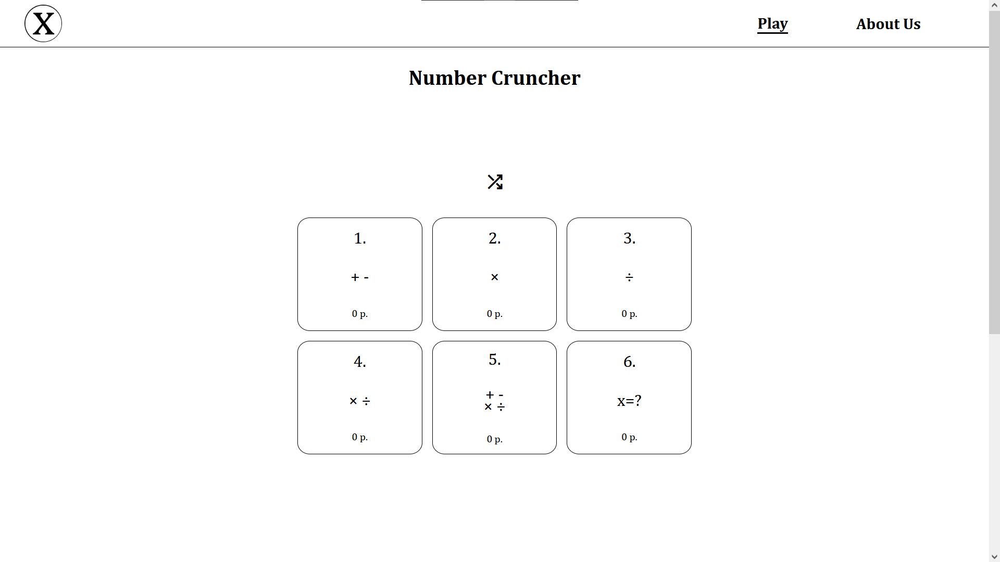
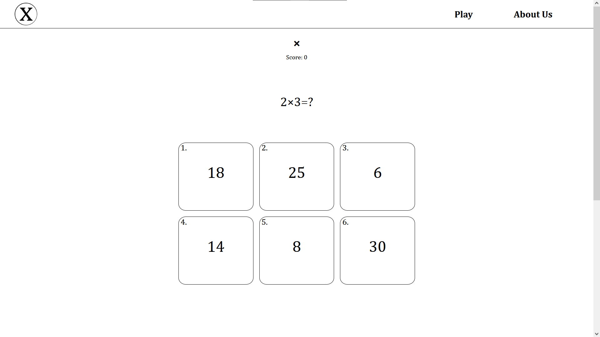

# Math Quiz Website

Hosted on [GitHub Pages](https://viggostrom.github.io/mathQuiz/).

## Description
This is a simple math quiz website that I created using HTML, CSS, and JavaScript. The website generates random math questions for the user to answer. The user can select the difficulty level of the questions. The website keeps track of the user's score and displays it at the end of the quiz. It is not persistent though beyond local storage. 

I made this as a part of the web development 1 course that I took my second year at NTI gymnasiet, Uppsala.

## Technologies
- HTML
- CSS
- JavaScript